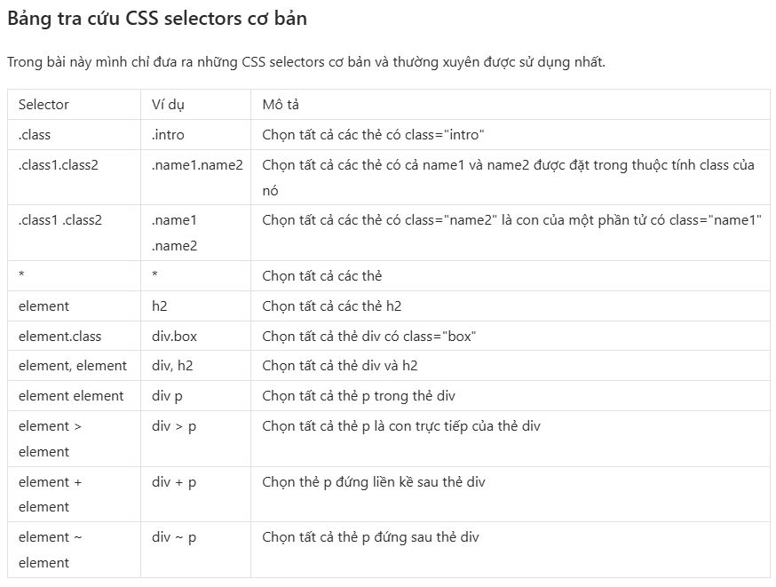

# F8 Project

This repository contains the source code for the F8 project, which includes various front-end web pages and assets.

## Project Structure
## Selector CSS

### Files and Directories

- **`.hintrc`**: Configuration file for development hints.
- **`README.md`**: Project documentation.
- **`docs/`**: Contains documentation assets like images.
- **`Front-end/`**: Contains HTML files and related assets.
  - **`food-page.html`**: A web page showcasing a food court.
  - **`index.html`**: The main landing page of the project.
  - **`units.html`**: A page demonstrating CSS units and styling.
  - **`assets/css/style.css`**: Stylesheet for the project.

## Features

- **Responsive Design**: The project uses responsive techniques for better user experience across devices.
- **CSS Styling**: Includes custom styles for various elements.
- **Interactive Content**: HTML pages with structured content and links.

## How to Use

1. Clone the repository:
   ```sh
   git clone https://github.com/KhanhNguyenNguci/F8.git